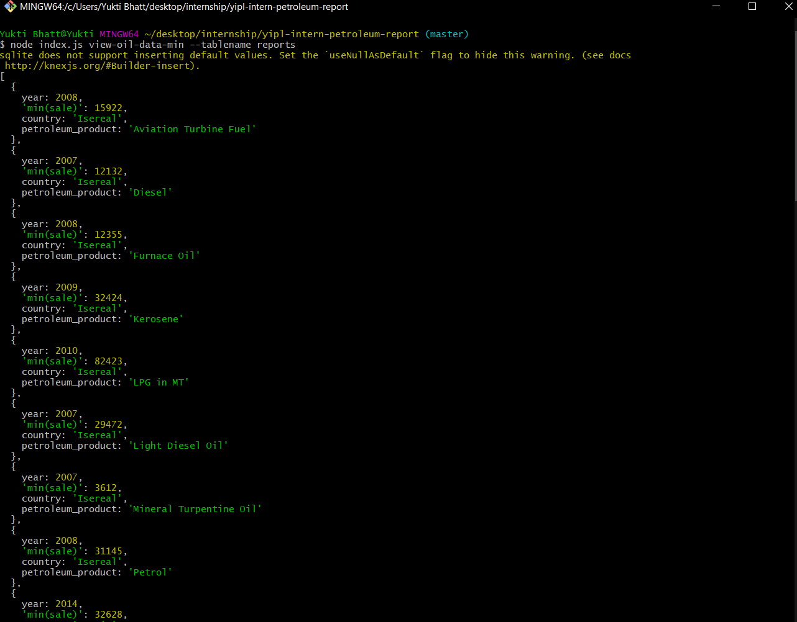

# CLI App with Node JS 
Node.js is an open-source, cross-platform, back-end JavaScript runtime environment that runs on the Chrome V8 engine and executes JavaScript code outside a web browser. 

This CLI app helps us to fetch the petroleum data and view it according to the given questions.
___
## Installation
Haedover to the https://nodejs.org/ and download the latest version of the node. The current version will have all the latest feature but may not be stable. So, for most of the cases we download the LTS version.

So, go head and click the LTS version download link button and download it to your computer. Go through the installation process and the Node.js will be installed to your computer.

Now, we have installed the Node.js in our computer and how do we know actually that it is installed or not.

Open a terminal and type the following command to check the version installed.
```shell
$ node -v
```
___
## Clone the repository
Clone the repository using your git bash or your terminal.
```shell
git clone https://yuktibhatt@bitbucket.org/yuktibhatt/yipl-intern-petroleum-report.git

```
___
## Installing Node Modules
Install the node modules as given below:
```shell
npm install

```
___
## Install sqlite database (For windows)
SQLite is an in-process library that implements a self-contained, serverless, zero-configuration, transactional SQL database engine. The code for SQLite is in the public domain and is thus free for use for any purpose, commercial or private. SQLite is the most widely deployed database in the world with more applications than we can count, including several high-profile projects.

1. Go to SQLite download page, and download precompiled binaries from Windows section.
2. Download sqlite-shell-win32-*.zip and sqlite-dll-win32-*.zip zipped files.
3. Create a folder C:\>sqlite and unzip above two zipped files in this folder, which will give you sqlite3.def, sqlite3.dll and sqlite3.exe files.
4. Add C:\>sqlite in your PATH environment variable and finally go to the command prompt and issue sqlite3 command, which should display the following result.

```shell
C:\>sqlite3
SQLite version 3.7.15.2 2013-01-09 11:53:05
Enter ".help" for instructions
Enter SQL statements terminated with a ";"
sqlite>
```
*For any other system other than windows visit the following link for installation: https://www.tutorialspoint.com/sqlite/sqlite_installation.htm

___
## Run Migrations
After installation od database, run the following commands to make migrations
```shell
npm run migrate
```
___

## CLI Commands 
1. To Fetch data for Petroleum Products from the data.json file using an API call. API endpoint https://raw.githubusercontent.com/younginnovations/internship-challenges/master/programming/petroleum-report/data.json
```shell
node index.js fetch-oil-data
```
 2. To Store data in a file:  
 ```shell 
 node index.js store-oil-data-in-file --filename data
 ```
 3. To store data in the database:  
```shell 
 node index.js store-oil-data --tablename reports
 ```
 4. To View all data:  
 ```shell
 node index.js view-oil-data --tablename reports
 ```
 5. To view average sale of each product by country: 
```shell
node index.js view-oil-data-avg --tablename reports
```
6. To view year of minimum sale of each product: 
```shell
node index.js view-oil-data-min --tablename reports
```

___

## Example 
1. To fetch the year of minimum sale
 

___

